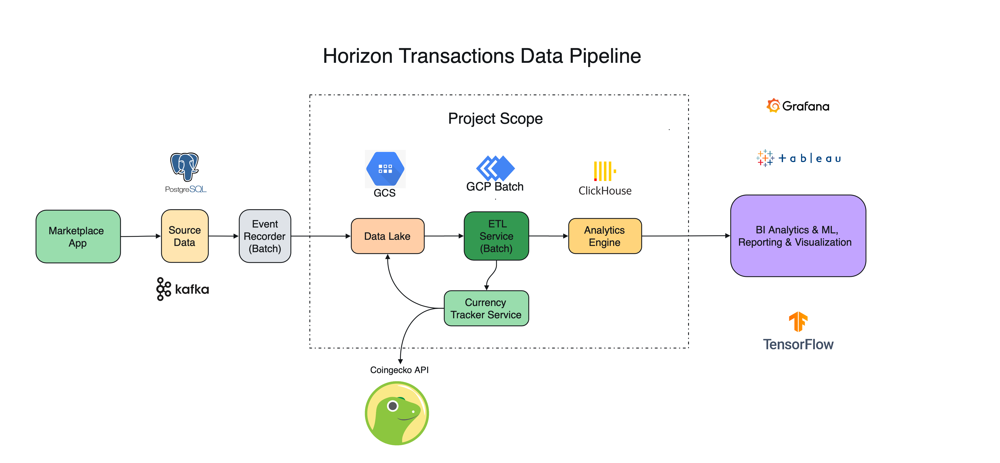

# Horizon Transaction Data Pipeline



# 0. Assumptions
1. A minimalistic data pipeline is being built (note to self - overengineered a bit)
2. Currency prices received from CoinGecko (or alternative) are valid for given market as default
3. Every transaction from provided data represents a fulfilled/closing order - meaning that for every `"BUY_ITEMS"` and `"SELL_ITEMS"` event, there's an opposite opening order not present in this data. Hence, every recorded transaction is a fulfilled transaction and can be directly contributed to daily volume indicators
4. Some transactions are, although recorded, invalid for ETL process. For instance `MATIC` `currencyAddress` contains `0x0000000000000000000000000000000000000000`, Genesis or Zero address used for burning tokens. Passing this data to analytics would invalidate the data down the pipeline and render results useless or worse, become misinformation
5. In the task description, volume in USD per project was requested, but it only makes sense to aggregate total market volume for all projects as well, so that is also included
6. Each ETL execution starts at least at 12:50am for given project requirements. Reason: Coingecko Docs: ```The last completed UTC day (00:00) is available 35 minutes after midnight on the next UTC day (00:35). The cache will always expire at 00:40 UTC```. Additional 10 minutes should be given to propagate cache invalidation for Coingecko itself and any network providers in the middle

# 2. Project Description
The following project is an almost fully self-contained in Docker (except for Coingecko API) ETL pipeline in Golang for extracting marketplace crypto transactions from emulated Google Cloud Storage, normalizing and aggregating market volume, and loading the result into an Analytics Engine, in this case, locally hosted Clickhouse instance

### Services & Tools Used:
- Google Cloud Storage emulation (Docker container)
- Clickhouse local instance (Docker container)
- Native Go GCS Driver
- GOCSV for marshalling/unmarshalling csv data files

### Application Structure
The app consists of multiple services that in this case are glued together via `app/main.go` and can be relatively easy converted into their own apps if needed by business logic:
- ETL Service:
  - Orchestrates the ETL process and manages core extract-transform-load functionality
  - Can be made into GCP Batch job and execute daily
- Currency Tracker Service (Usecase/Repository):
  - Manages the metadata and currency caching needed to properly understand transactions data (e.g. tracks currencies, maps currency symbols to ids and platforms, maintains currency prices for given day). Accesses Coingecko API for currency data
- GCS Service (Usecase/Repository):
  - Can be used as thin server-bridge for GCS. Has higher order Interactor methods to interface with Transactions storage to reduce responsibility and statefullness of ETL 
  - GCS Buckets:
    - `currency-prices`: keeps track of daily avg prices
      - [2024-04-01.csv](data/sample/gcs/currency-prices/2024-04-01.csv)
    - `currency-registry`: keeps registry of all coins and tracked coins (valid coins seen in transactions) 
        - [currency_registry.csv](data/sample/gcs/currency-registry/currency_registry.csv)
        - [tracked_currencies.csv](data/sample/gcs/currency-registry/tracked_currencies.csv)
    - `daily-transactions`: stores actual transaction data (e.g. `sample_data.csv`)
      - [2024-04-01.csv](data/sample/gcs/daily-transactions/2024-04-01.csv)
- Clickhouse Service (Repository):
  - Provides basic Clickhouse upload functionality
  - Database: `market_analytics`
    - Table: `daily_market_volume`: aggregate of total market volume per day
      - `date`
      - `transactions_amount`
      - `total_volume_usd`
    - Table: `daily_project_volume`: aggregate of project volume per day
      - `project_id` 
      - `date`
      - `transactions_amount`
      - `total_volume_usd`

# 3. Installation Process

1. Make sure you have Docker installed and running. For running Clickhouse queries after ETL is finished, make sure Clickhouse CLI is installed (e.g. `brew install clickhouse`)
2. Add Coingecko API KEY to `container.env` (env file be read from existing env variable e.g. `$COINGECKO_API_KEY`)
   - If there are any issues with the Coingecko API Key, set `COINGECKO_LIMIT_RATE` env var to true
3. Execute `make start-etl` to pull all images, build the app, and start the container network 

This will execute ETL pipeline for a given `container.env/$ETL_DATE`. After ETL is complete, `etl` container will exit while `clickhouse` and `gcs` will remain running. You may run additional etl dates with `make start-etl-container-only` in a separate terminal tab/window

Optionally: 
- To run docker compose in fully isolated environment without Coingecko API call, uncomment `gcs` `volumes` entry `${PWD}/fs/volumes/gcs:/data` to preload all seed data (transactions, currency registry, tracked currency, and daily prices) and set `INIT_FROM_SCRATCH` in `container.env`
- Change `ETL_DATE` to run ETL on a different date

# 4. Results

After running ETL for all dates available in `sample_data.csv`

### DailyProjectVolume
```
$ clickhouse client --user analytics_user --password complex_password
clickhouse_analytics :) select * from market_analytics.daily_project_volume order by created_at;

SELECT *
FROM market_analytics.daily_project_volume
ORDER BY created_at ASC

Query id: 3901ad7e-5fd3-4686-9ed4-d4196f97a894

   ┌─id───────────────────────────────────┬─project_id─┬───────date─┬─transactions_amount─┬───total_volume_usd─┬──────────created_at─┬──────────updated_at─┬──────────deleted_at─┐
1. │ 2af7c5a9-4de6-4a09-b01d-e24c9daaf6f3 │ 0          │ 2024-04-01 │                  98 │  345.1778485648536 │ 2024-07-17 11:05:37 │ 2024-07-17 11:05:37 │ 1970-01-01 00:00:00 │
2. │ 9e38def2-3c42-4f48-88ce-8a2f3d05802b │ 4974       │ 2024-04-01 │                  97 │ 20473733.590611115 │ 2024-07-17 11:05:37 │ 2024-07-17 11:05:37 │ 1970-01-01 00:00:00 │
3. │ 5a309acb-05c7-42f9-a223-a6305d9e33b1 │ 4974       │ 2024-04-02 │                  94 │ 1089015.7856802226 │ 2024-07-17 11:06:03 │ 2024-07-17 11:06:03 │ 1970-01-01 00:00:00 │
4. │ e53c8fac-ad5a-4581-ab81-c1023ab85117 │ 0          │ 2024-04-02 │                 102 │ 474.14369796700885 │ 2024-07-17 11:06:03 │ 2024-07-17 11:06:03 │ 1970-01-01 00:00:00 │
5. │ 2e6a5a19-37ef-4dfd-97c4-8907aeb2cbc7 │ 4974       │ 2024-04-15 │                 149 │ 224.78065010297883 │ 2024-07-17 11:06:23 │ 2024-07-17 11:06:23 │ 1970-01-01 00:00:00 │
6. │ 7ec97c15-ec99-40d1-9540-3b2aee219b5d │ 1660       │ 2024-04-15 │                   1 │  5.174642422200194 │ 2024-07-17 11:06:23 │ 2024-07-17 11:06:23 │ 1970-01-01 00:00:00 │
7. │ ae9ff896-8b64-4d61-be3e-378b78a9a73f │ 0          │ 2024-04-15 │                 292 │  376.1877830573131 │ 2024-07-17 11:06:23 │ 2024-07-17 11:06:23 │ 1970-01-01 00:00:00 │
8. │ 6d2630d9-8609-4594-8edc-bbe20a5ee2e8 │ 4974       │ 2024-04-16 │                  39 │ 6.990062105634129  │ 2024-07-17 11:06:36 │ 2024-07-17 11:06:36 │ 1970-01-01 00:00:00 │
9. │ fd5a74fb-df93-4b4c-902a-2981b14ccc71 │ 0          │ 2024-04-16 │                  62 │ 31.57109278586085  │ 2024-07-17 11:06:36 │ 2024-07-17 11:06:36 │ 1970-01-01 00:00:00 │
   └──────────────────────────────────────┴────────────┴────────────┴─────────────────────┴─────────────────── ┴─────────────────────┴─────────────────────┴─────────────────────┘
```
   
Or row data:
```
2e6a5a19-37ef-4dfd-97c4-8907aeb2cbc7	4974	2024-04-15	149	224.78065010297883	2024-07-17 11:06:23	   2024-07-17 11:06:23	   1970-01-01 00:00:00
7ec97c15-ec99-40d1-9540-3b2aee219b5d	1660	2024-04-15	1	5.174642422200194	2024-07-17 11:06:23	   2024-07-17 11:06:23	   1970-01-01 00:00:00
ae9ff896-8b64-4d61-be3e-378b78a9a73f	0	2024-04-15	292	376.1877830573131	2024-07-17 11:06:23	   2024-07-17 11:06:23	   1970-01-01 00:00:00
2af7c5a9-4de6-4a09-b01d-e24c9daaf6f3	0	2024-04-01	98	345.1778485648536	2024-07-17 11:05:37	   2024-07-17 11:05:37	   1970-01-01 00:00:00
9e38def2-3c42-4f48-88ce-8a2f3d05802b	4974	2024-04-01	97	20473733.590611115	2024-07-17 11:05:37	   2024-07-17 11:05:37	   1970-01-01 00:00:00
6d2630d9-8609-4594-8edc-bbe20a5ee2e8	4974	2024-04-16	39	6.990062105634129	2024-07-17 11:06:36	   2024-07-17 11:06:36	   1970-01-01 00:00:00
fd5a74fb-df93-4b4c-902a-2981b14ccc71	0	2024-04-16	62	31.57109278586085	2024-07-17 11:06:36	   2024-07-17 11:06:36	   1970-01-01 00:00:00
5a309acb-05c7-42f9-a223-a6305d9e33b1	4974	2024-04-02	94	1089015.7856802226	2024-07-17 11:06:03	   2024-07-17 11:06:03	   1970-01-01 00:00:00
e53c8fac-ad5a-4581-ab81-c1023ab85117	0	2024-04-02	102	474.14369796700885	2024-07-17 11:06:03	   2024-07-17 11:06:03	   1970-01-01 00:00:00
```

### DailyMarketVolume
```
clickhouse_analytics :) select * from market_analytics.daily_project_volume order by created_at;
SELECT *
FROM market_analytics.daily_market_volume
ORDER BY created_at ASC

Query id: 58576859-4d37-4f95-8c39-458e362bbfc6

   ┌─id───────────────────────────────────┬───────date─┬─transactions_amount─┬──total_volume_usd─ ┬──────────created_at─┬──────────updated_at─┬──────────deleted_at─┐
1. │ cd830112-0bdc-4ce7-9c11-6df7e9d964d9 │ 2024-04-01 │                 195 │ 20474078.76845967  │ 2024-07-17 11:05:37 │ 2024-07-17 11:05:37 │ 1970-01-01 00:00:00 │
2. │ f5488da7-08dc-4f52-9cbb-41d00dbb5206 │ 2024-04-02 │                 196 │ 1089489.9293781896 │ 2024-07-17 11:06:03 │ 2024-07-17 11:06:03 │ 1970-01-01 00:00:00 │
3. │ fc44fcbe-a783-4db1-b0e5-f42da7c43ee6 │ 2024-04-15 │                 442 │ 606.1430755824923  │ 2024-07-17 11:06:23 │ 2024-07-17 11:06:23 │ 1970-01-01 00:00:00 │
4. │ efe03c36-3c7e-4c25-8a89-c3a321f062d4 │ 2024-04-16 │                 101 │ 38.561154891494965 │ 2024-07-17 11:06:36 │ 2024-07-17 11:06:36 │ 1970-01-01 00:00:00 │
   └──────────────────────────────────────┴────────────┴─────────────────────┴────────────────────┴─────────────────────┴─────────────────────┴─────────────────────┘
```
   
Or raw data:
```
efe03c36-3c7e-4c25-8a89-c3a321f062d4	2024-04-16	101	38.561154891494965	2024-07-17 11:06:36	2024-07-17 11:06:36	1970-01-01 00:00:00
fc44fcbe-a783-4db1-b0e5-f42da7c43ee6	2024-04-15	442	606.1430755824923	2024-07-17 11:06:23	2024-07-17 11:06:23	1970-01-01 00:00:00
f5488da7-08dc-4f52-9cbb-41d00dbb5206	2024-04-02	196	1089489.9293781896	2024-07-17 11:06:03	2024-07-17 11:06:03	1970-01-01 00:00:00
cd830112-0bdc-4ce7-9c11-6df7e9d964d9	2024-04-01	195	20474078.76845967	2024-07-17 11:05:37	2024-07-17 11:05:37	1970-01-01 00:00:00
```
